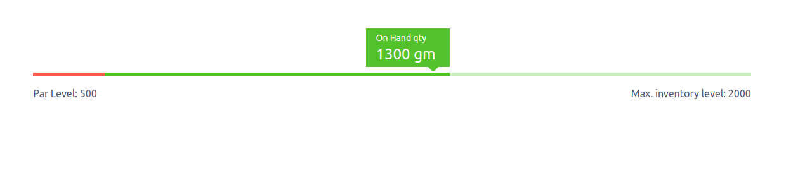

# <p align="center">Ranger</p>

A react component for rendering ranged values.



### Usage

```js
<Ranger
  min={500}
  max={2000}
  value={1300}
  minLabel="Par Level"
  maxLabel="Max. inventory level"
  label="On Hand qty"
  unit="gm"
/>
```

### prop types

```typescript
type RangerProps = {
  min: number;
  max: number;
  value: number;
  minLabel: string;
  maxLabel: string;
  label: string;
  unit?: string;
};
```
